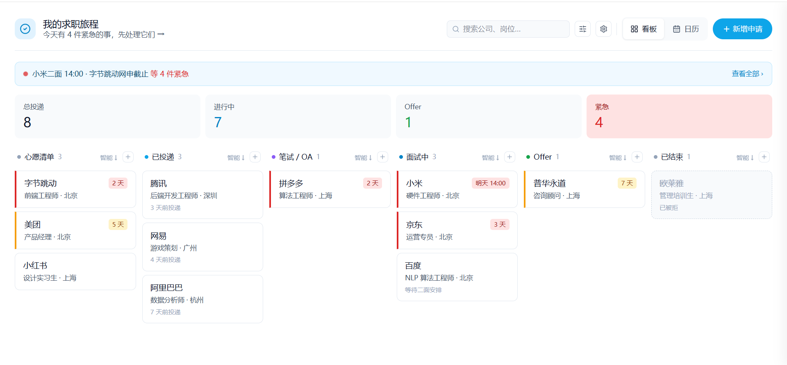
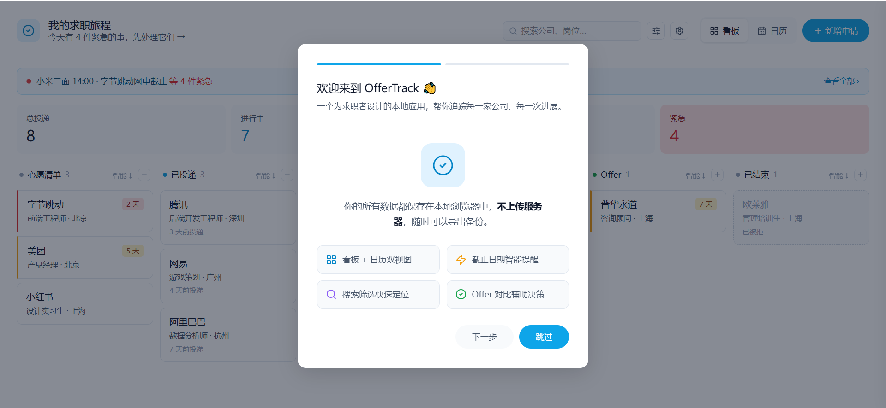

# OfferTrack · 我的求职旅程

> 一个为求职者设计的本地看板应用。追踪申请进展、截止日期和面试安排，不遗漏任何机会。

## 界面预览





## 功能概览

### 看板视图

六列看板对应求职全流程：**心愿清单 → 已投递 → 笔试/OA → 面试中 → Offer → 已结束**。

- 卡片显示公司、岗位、城市、薪资、截止日期，一览无余
- 支持跨列拖拽移动，也可在同列内手动拖拽调整顺序
- 拖入"已结束"列时弹出原因选择（主动放弃 / 被拒 / 已接受 Offer）
- 每列独立支持智能排序（按紧急程度）或手动排序
- Offer 列提供"对比"入口，≥2 个 Offer 时可跳转对比器

### 紧急提醒

- 截止日期 ≤3 天：卡片标红，顶部 Banner 列出具体事项
- 截止日期 3–7 天：卡片标黄警示
- Banner 显示最近 2 条紧急事项，多余的显示"另有 N 件"
- "查看全部"按钮一键筛选出所有紧急卡片

### 卡片详情

点击卡片从右侧滑入详情抽屉，包含：

- **时间线**：自动汇总申请、OA、各轮面试、Offer 等节点，按时间排序，支持状态标色（通过 / 未过 / 待定）
- **材料清单**：简历、求职信、作品集、成绩单、推荐信，逐项勾选确认，简历支持记录版本号
- **备注**：自由文本，失焦后自动保存，无需手动提交
- **操作栏**：一键编辑基本信息、删除申请（二次确认）

### 日历视图

- 月历视图展示所有带日期的事项（截止日、面试、OA 等）
- 按紧急程度着色：红色（≤3天）、橙色（≤7天）、蓝色（更晚）、灰色（已过期）
- 同一天最多显示 3 条，超出显示"+N 条"

### 搜索与筛选

- 顶部实时搜索，匹配公司名和岗位名
- 筛选面板支持多维度组合筛选：行业标签、城市、紧急程度
- 筛选激活时显示命中数量和一键清除按钮

### Offer 对比器

- 从 Offer 列选择 2–4 个 Offer 进行横向对比
- 预置维度：发展空间、工作强度、团队氛围、薪资水平
- 支持自定义评分维度，点击添加 / 删除
- 每个维度 1–5 星打分，自动汇总总分并标注推荐 Offer
- 评分实时保存，下次打开依然保留

### 数据管理

- **导出**：一键将所有数据导出为 JSON 文件，文件名含日期（如 `offertrack-backup-20250419.json`）
- **导入**：支持"合并导入"（保留现有 + 追加新增）和"覆盖导入"（清空后全量替换）
- **清空**：二次确认后清除所有数据，回到初始状态
- 所有数据存储在浏览器 localStorage，无服务器、无账号，完全私密

## 技术栈

| 层次 | 技术 |
|------|------|
| 构建 | Vite 8 |
| UI | React 19 + TypeScript |
| 样式 | Tailwind CSS v4（CSS-in-JS inline styles + 少量 Tailwind 工具类） |
| 拖拽 | @dnd-kit/core + @dnd-kit/sortable + @dnd-kit/utilities |
| 日期 | date-fns v3 |
| ID | nanoid |
| 持久化 | localStorage（带 300ms debounce） |

## 本地运行

```bash
# 克隆仓库
git clone <repo-url>
cd offertrack

# 安装依赖
npm install

# 启动开发服务器（支持热更新）
npm run dev

# 生产构建
npm run build

# 预览生产构建
npm run preview
```

开发服务器默认运行在 http://localhost:5173

## 部署到 Vercel

### 一键部署

点击按钮直接部署到 Vercel（需要 GitHub 账号）：

[](https://vercel.com/new/clone?repository-url=https://github.com/YOUR_USERNAME/OfferTrack&project-name=offertrack&repository-name=OfferTrack)

### 手动部署步骤

**方式 1：使用 Vercel CLI**

```bash
npm i -g vercel
cd offertrack
vercel
```

**方式 2：连接 GitHub 仓库**

1. 推送代码到 GitHub
   ```bash
   git add .
   git commit -m "feat: complete offertrack development"
   git push origin main
   ```

2. 在 [vercel.com](https://vercel.com) 新增项目
   - 点击 "Add New" → "Project"
   - 选择 "Import Git Repository"
   - 连接 GitHub 账号，搜索并选择 OfferTrack 仓库

3. 配置构建设置
   - **Framework Preset**: Vite
   - **Root Directory**: ./offertrack（如果 vercel.json 在此目录）
   - **Build Command**: `npm run build`
   - **Output Directory**: `dist`
   - **Install Command**: `npm install`

4. 环境变量（可选）
   - 此项目无需环境变量（所有数据存储在本地 localStorage）

5. 点击 "Deploy"

### 获取线上链接

部署完成后，Vercel 会分配一个域名，如 `https://offertrack.vercel.app`

访问该链接即可看到完整的看板应用。数据会存储在你的本地浏览器中，无需后端。

### 自定义域名

在 Vercel 项目设置中：
- Settings → Domains
- 添加自定义域名
- 按照说明配置 DNS 解析

---
## 目录结构

```
offertrack/src/
├── components/
│   ├── Board/           # 看板（Board、Column、JobCard、拖拽相关）
│   ├── CalendarView/    # 月历视图
│   ├── Card/            # JobCard 组件
│   ├── CardDetailDrawer/# 卡片详情抽屉
│   ├── FilterPanel/     # 筛选面板
│   ├── NewJobModal/     # 新增/编辑弹窗
│   ├── OfferComparator/ # Offer 对比器
│   ├── StatsBar/        # 数据概览条
│   ├── UrgentBanner/    # 紧急事项 Banner
│   └── shared/          # Header、Layout、SearchInput、SettingsMenu、Onboarding
├── hooks/
│   ├── useJobs.ts       # 申请数据 CRUD
│   ├── useSettings.ts   # 视图、排序、维度设置
│   └── useLocalStorage.ts
├── lib/
│   ├── constants.ts     # 列配置、行业标签、存储键
│   ├── sorting.ts       # 智能排序逻辑
│   ├── urgency.ts       # 紧急程度计算
│   └── sampleData.ts    # 示例数据
├── types/index.ts       # TypeScript 类型定义
├── App.tsx
└── index.css
```

## 已知问题

- Mobile 视图（<768px）目前以水平滚动看板为主，单列切换器未实现
- 日历视图同一天超过 6 个事件时仅显示前 3 条 + "+N 条"提示
- 拖拽在触屏设备上需要长按 300ms 才能激活（`@dnd-kit` 默认行为）

---

MIT License · 用爱发电，祝你求职顺利 ✦
